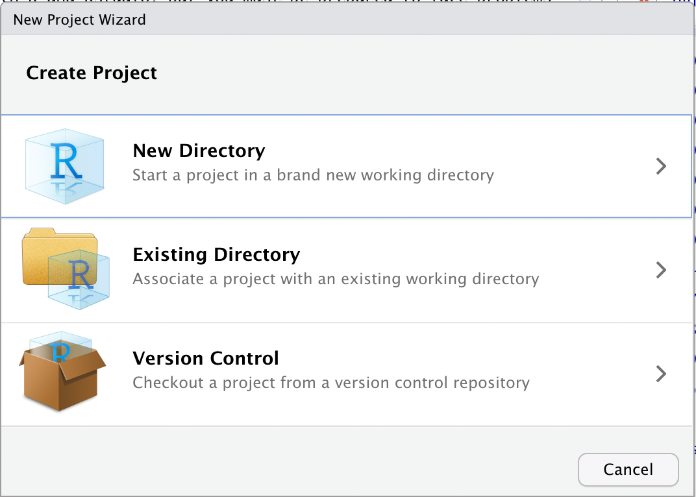

# Introduction to R{#ItoR_00}

[*in progress*]

This chapter offers a general introduction to R.

0. General Introduction
1. Basics I: Data Structures and Subsetting
2. Basics II: Data Manipulation & Exloratory Analysis
3. Basics III: Data Visualization; Functions

## R Installation

* Install R and R Studio and start working with them
	* R <https://www.r-project.org/> 
	* R Studio <https://www.rstudio.com/>
* If you prefer video instructions, you can try [“How to download and install R and RStudio
”](https://www.youtube.com/watch?v=TFGYlKvQEQ4) on YouTube.

Possible Issues:

- Both R and RStudio may refuse to install if your computer and operating system is too old. For example, in late 2022, this was an attested problem with a MacBook Air 2015 with the MacOS High Sierra 10.13.6.
  - Possible Solutions:
    a) you should try to update your operating system. This, however, might be not possible if your hardware does not support newer operating systems.
    b) you can try to install older versions of both R and Rstudio, but you must be prepared to face problems every step of the way later on. Not the ideal solution.
    c) well, if nothing works, you may have to bite the bullet and get a new computer.

## Using “Projects”

Projects are a very convenient feature of RStudio. The idea is very simple---Rstudio ties all settings to a specific folder, which makes it much easier to work with files kept in the same folder. How to use projects?

1. create a folder somewhere on your computer; let’s call that folder “My_First_R_Project”, for further reference;
2. move files that you are going to work with into that folder;
3. open RStudio, then, in the main menu, choose: File > New Project (you should then see “New Project Wizard”, as shown below);

4. Select “Existing Directory” > then click on “Browse”, and then select the folder “My_First_R_Project”, which you created in the first step; click “Create Project” to complete the process.
5. Now, what will happen is that in the tab “Files” in the lower right part of RStudio you will see the contents of the folder “My_First_R_Project”. There will also be a new file, called “My_First_R_Project.Rproj”.
  - Later on, you will be able to quickly open your project by double-clicking on that file.
  - When you open te project, R automatically sets the working directory (`setwd()`) to the folder of the project and many things just become much easier.
6. Now, you can add and create new files relevant to your project in the folder “My_First_R_Project” and they will be easy to find directly from RStudio, using its “Files” Tab, which is usually available in the lower right corner. **Suggestion:** you will benefit greatly from keeping some order in your project folder. For example, keep all you data files in a subfolder “data”; your images in a subfolder “images”, and so on.

## General Introduction


### Goals{#ItoR_goals}


### Class{#ItoR_class}

* R Studio Interface
  * four-partite division
* Creating a project
  - create some folder where you are going to keep everything related to te course;
  - create a project, pointing to that folder;
* Installing libraries (packages)
  - `install.packages("nameOfLibrary")`
* R Notebook elements: combining prose and code
* Converting R Notebook into different formats

#### Installing `rmarkdown`{#ItoR_installation}

Instructions here: <https://bookdown.org/yihui/rmarkdown/installation.html>

More information on R Markdown:

* <https://rmarkdown.rstudio.com/lesson-1.html>
* <https://bookdown.org/yihui/rmarkdown/> 


### Starting with our first workbook:

Now, download two worksheet files:

- [00_worksheets_basics_of_rmarkdown.zip](./files/ws_new/00_worksheets_basics_of_rmarkdown.zip)
- [01_worksheets_familiar-with-r_NEW.zip](./files/ws_new/01_worksheets_familiar-with-r_NEW.zip)

Unzip them and open in `RStudio`. Let's work through it!

**NB:** Original worksheets prepared by Lincoln Mullen, GMU (<https://dh-r.lincolnmullen.com/worksheets.html>)

### Topics covered{#ItoR_topics}

- `00_worksheets_basics_of_rmarkdown.zip`
  - basics of R markdown;
- `01_worksheets_familiar-with-r_NEW.zip`
  - Values
  - Variables
  - Vectors
  - Built-in functions
  - Using the documentation
  - Data frames
  - Installing and loading packages
  - Simple plots


### Reference materials{#ItoR_RM}

Two main books on R markdown:

* <https://bookdown.org/yihui/rmarkdown/>;
* <https://bookdown.org/yihui/rmarkdown-cookbook/>;
  
* *R Primer* (<https://dh-r.lincolnmullen.com/primer.html>) in: Lincoln A. Mullen, *Computational Historical Thinking: With Applications in R (2018–):* <https://dh-r.lincolnmullen.com>.
	* Use the this primer as a quick introduction to the `R` language, or as a reference for the rest of the course.
* The original worksheets have been developed by Lincoln Mullen (<https://dh-r.lincolnmullen.com/worksheets.html>). The ones used in this class might have undergone some changes and relevant adaptations.
* Your `R` installation may ‘speak’ your main language. It is nice on one hand, but can be quite inconvenient in class, where the main language is English. You may have to do cast some spells to switch `R` into English. Possible solutions can be found here: <https://stackoverflow.com/questions/13575180/how-to-change-language-settings-in-r/>

### Homework{#ItoR_HW}

* Complete the worksheet *Getting familiar with R*.
* Generate the results into HTML or PDF (PDF is a little bit trickier).
* Start working through the first assigned course in DataCamp (two weeks to complete; requires about 4 hours)
* Submit your homework as described below.

### Common issues with homework{#ItoR_commonIssues}

#### Tracing errors

Errors happen all the time. You will run into errors when you run your code. You will run into error messages when "knitting" your document --- as a result, your document will not be generated. To resolve this:

1. It is important to run each chunk of code separately to ensure that they all work. If any of the chunks throw errors, you will not be able to "knit" your documents.
2. When you run into an error, `R Markdown` panel (usually in the lower left corner of RStudio interface) will tell you in which line the error occurred. You will need to fix it the same way you would in Step 1.

#### Comments / Commenting out{#ItoR_Comments}

You do not want to constantly keep [re]installing libraries. So, if a library is already installed, you can "comment out" that line.

```{r, eval=FALSE}
install.packages("gapminder")
install.packages("tidyverse")
```

For example, the code chunk above should become: 

```{r, eval=FALSE}
 #install.packages("gapminder")
 #install.packages("tidyverse")
```

Adding `#` in front of a line (or a section of a line) turns it into a `comment` and it will not longer be executed.

#### Random errors:{#ItoR_RandomErrors}

Think about the following two lines of code. Any issues that you can explain? (You might want to run these lines in R to get some clues)

* ``` `?median` ```
* `variable1 <- DigitalHumanities`

### Submitting homework{#ItoR_SHW}

* Homework assignment must be submitted by the beginning of the next class;
* Email your homework to the instructor as attachments.
	*  In the subject of your email, please, add the following: `57528-LXX-HW-YourLastName-YourMatriculationNumber`, where `LXX` is the number of the lesson for which you submit homework; `YourLastName` is your last name; and `YourMatriculationNumber` is your matriculation number.