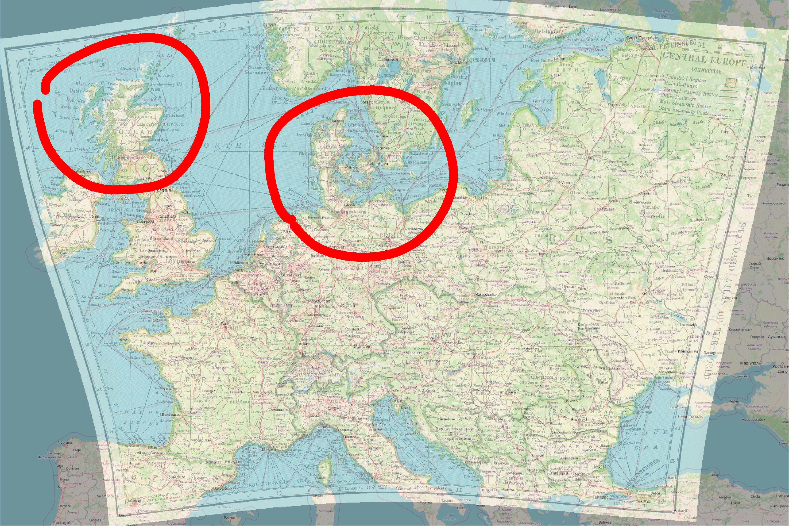
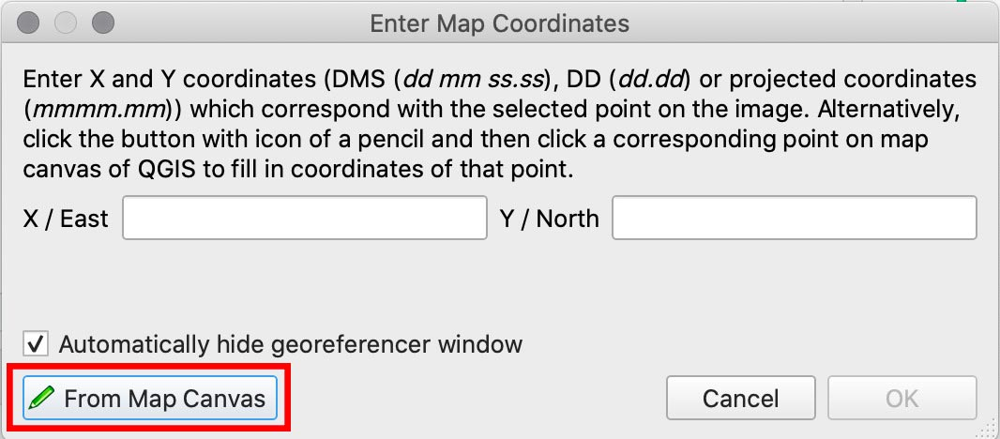
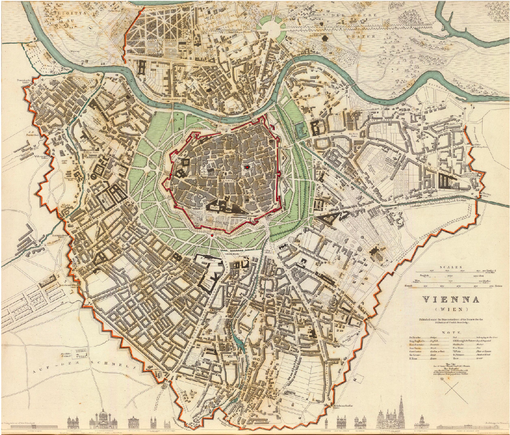
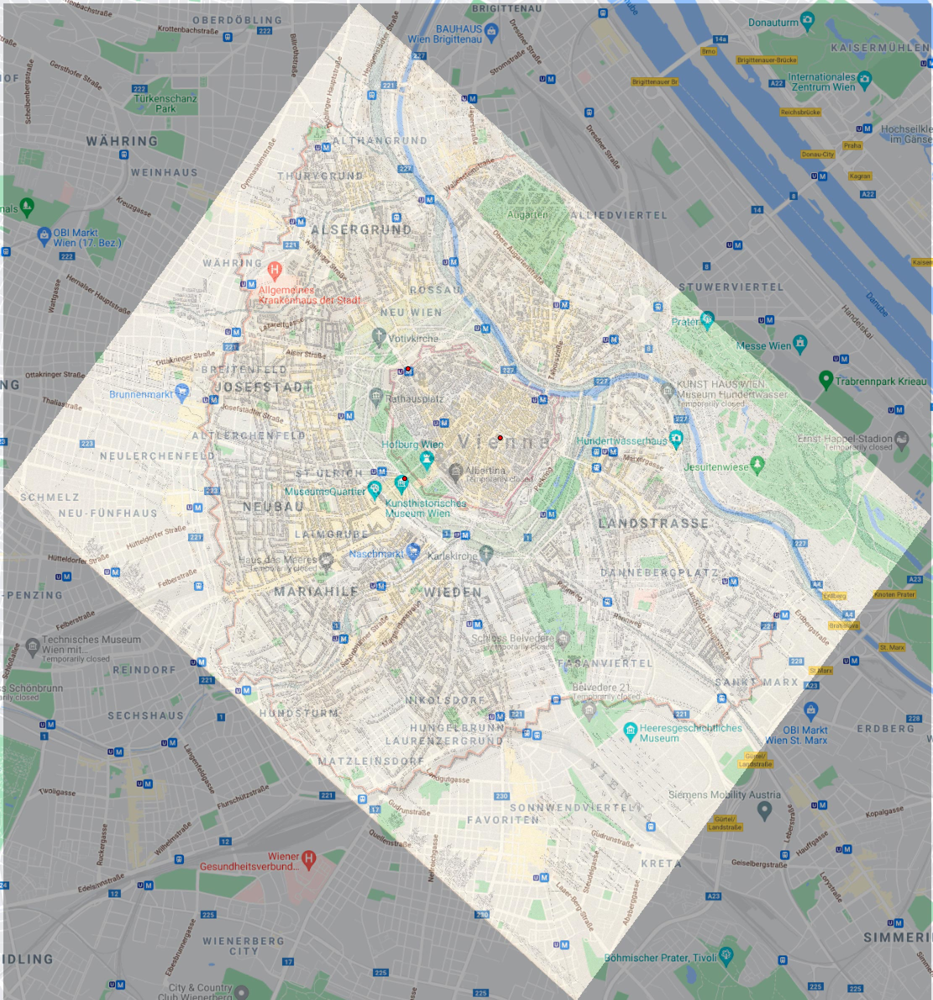
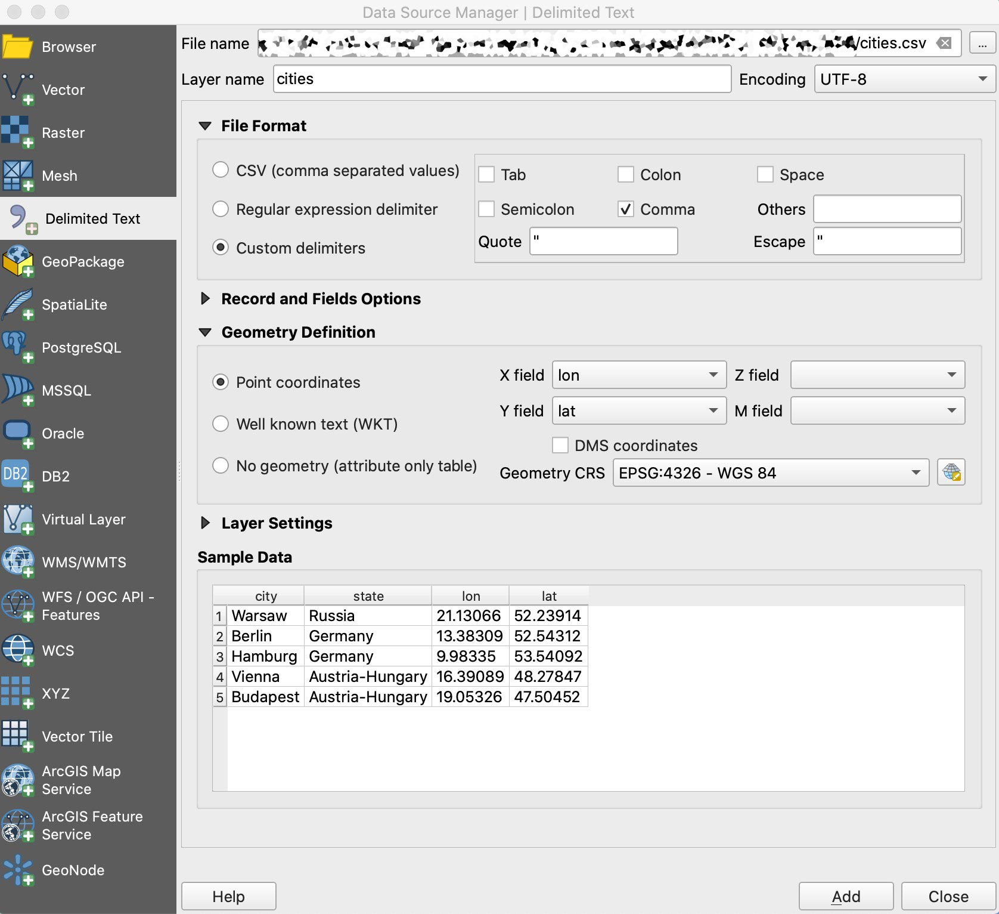

### Georeferencing & Geocoding

#### Goals{#TAG07}

Learning about what georeferencing and geocoding are.
Learning how to do georeferencing and geocoding.

#### Software{#SOFT07}

- QGIS, <https://qgis.org/>
- R

#### Additional Materials

- QGIS tutorials in *Mapping for Historians*: <http://transnationalhistory.net/mapping/tutorials/>
  - specifically on georeferencing: <http://transnationalhistory.net/mapping/tutorials/georeferencing/>
- More general QGIS Tutorials: <http://www.qgistutorials.com/en/index.html>
- Additionally, see tutorials on *Programming Historian* in the section `mapping`: <https://programminghistorian.org/en/lessons/?topic=mapping>
  - Clifford, Jim, Josh MacFadyen, and Daniel Macfarlane. 2013. “Installing QGIS 2.0 and Adding Layers.” Programming Historian, December. <https://programminghistorian.org/lessons/qgis-layers>.
  - Clifford, Jim, Josh MacFadyen, and Daniel Macfarlane. 2013. “Georeferencing in QGIS 2.0.” Programming Historian, December. <https://programminghistorian.org/lessons/georeferencing-qgis>.

<!-- ### Projection Issues -->

<!--  -->

<!-- See, <https://en.wikipedia.org/wiki/List_of_map_projections>. -->

<!-- ### A Digital Map: Layers of Goodness -->

<!--  -->

<!-- * Layers: -->
<!-- 	* Analytical Layer -->
<!-- 	* Our Data -->
<!-- 	* Annotation/Legend -->
<!-- * Social Geography -->
<!-- 	* Political Boundaries -->
<!-- 	* Settlements, etc. -->
<!-- * Physical Geography -->
<!-- 	* Types of surface -->
<!-- 	* Continents / Coastal Line -->
<!-- 	* Elevation profile -->
<!-- 	* Rivers, Lakes, etc. -->
<!-- * Base Layer: Graticule -->

<!-- ### Main Types of Data: Points, Lines, Polygons -->

<!-- * Analytical Layer -->
<!-- 	* Our Data -->
<!-- 		* Points: -->
<!-- 			* item, x**[1]**, point(lat, lon)**[2]** -->
<!-- 		* Lines: -->
<!-- 			* item, x**[1]**, from(lat, lon)**[2]**, to(lat, lon)**[2]** -->
<!-- 		* Polygons: -->
<!-- 			* item, x, area(lat, lon; lat, lon; … lat, lon)**[2]** -->

<!-- 	* Annotation/Legend -->

<!-- **[1]** where x is a categorical parameter; **[2]** lat/lon: decimal coordinates (not DMS) -->

### Georeferencing

Georeferencing can be defined as a process of associating digital images (pictures of a maps) with locations in physical space. What we do in this process is projecting an image of a map on geographical coordinate system. After this process of projection or association is complete, objects on georeferenced maps acquire geographical coordinates, which can be harvested for use in other projects. 

#### QGIS

QGIS must be installed and running. *Note:* Interfaces might differ from system to system; the same applies to different versions of QGIS. Before we proceed, you may want to add Google Layers. To Add Google maps layer: (on the left pane, *Browser*) XYZ > New connection > paste one of the following links (Source:  <https://geogeek.xyz/how-to-add-google-maps-layers-in-qgis-3.html>):

1. **Google Maps**: https://mt1.google.com/vt/lyrs=r&x={x}&y={y}&z={z}
3. **Google Satellite**: http://www.google.cn/maps/vt?lyrs=s@189&gl=cn&x={x}&y={y}&z={z}
4. **Google Satellite Hybrid**: https://mt1.google.com/vt/lyrs=y&x={x}&y={y}&z={z}
5. **Google Terrain**: https://mt1.google.com/vt/lyrs=t&x={x}&y={y}&z={z}
6. **Google Roads**: https://mt1.google.com/vt/lyrs=h&x={x}&y={y}&z={z}

**NB:** Images of maps to work with below

#### Step-by-step instructions


* Let's georeference this old map of Europe. Here is the link: [*OldDesignShop_MapCentralEurope.jpg*](./files/QGIS/OldDesignShop_MapCentralEurope.jpg).
* In your `XYZ Tiles`, double click on any Google layer that you added (or on OpenStreetMap)
	* A layer should be added to the main map (see, Layer pane)
* Open Georeferencer: `Raster` > `Georeferencer`
	* if you do not see it there, it must be activated first:
		* `Plugins` > `Manage and Install Plugins...` > [search for *georeferencer*], then tick a box against **Georeferencer GDAL**
* In Georeferencer: `File` > `Open Raster` (also the first button on the main panel)
	* Choose a file. Lets start with [*OldDesignShop_MapCentralEurope.jpg*](./files/QGIS/OldDesignShop_MapCentralEurope.jpg) (this one has a grid, so it will be easier to process)
	* In *Coordinate Reference System Selector*, choose **WGS 84 / Pseudo-Mercator**, then clock `OK`
* Open `Settings` > `Transformation settings` (or click the yellow gears button)
	* Choose settings like on the screenshot below (you can also change `Compression` setting, which will generate a smaller map-image):
	  * **Important!** Make sure to select `EPSG:4326 - WGS 84` in **Target SRS**. (If your map is tiny and appears somewhere in the Atlantic ocean near the coast of West Africa, you have selected a wrong target **S**patial **R**eference **S**ystem!)

* Now, adding georeference points:

	* If you have a grid, it is very easy: just type in coordinates
	* If you don't, it is tricky: you need to find the same features on the image and on the map (for this, click on `From Map Canvas`)
* **[!!!]** Ideally, if you know projection of the map, you only need a few points; this almost never happens, so, the more points you create, the more precisely your image will be georeferenced. This is easy when you have a grid. 
* When you are done with collecting points, click on `PLAY` button (green triangle)
	* The image of your georeferenced map should appear in the main window.
* **[!!!]** Keep in mind that you add layers to your map and a layer on top may cover the layer below!

Below you can see how a georeferences map would look, if only 4 points GCP (ground reference points) have been collected. In the areas circled with red you can see that the northern par of the UK and Denmark are not very well aligned.


In the example below you the georeferences map has about a dozen GCP. Alignment of the northern part of the UK and Denmark is much better. In general, if you have a clear coordinate grid on your maps, you may want to georeference all intersections---this will give you the best possible results.



In general, this procedure can be extremely helpful if:

* you need to collect geographical information from historical maps;
* you want to use some historical map as the base layer for mapping your data;


### Georeferencing maps without a grid

You may have a map that does not have any grid. In this case you will have to georeference your map by visual cues. The steps are the same as above, but instead of typing in the coordinates, you will need to identify the same visual features on the map that you georeference (your source map) and the base layer map loaded into QGIS (your target map).

- First, you click on the selected feature on your source map.
- Then, click on “From Map Canvas”
- Then, find the same feature on the target map and click there --- the GCP will be automatically created.



For for our practice we will use [the following old map of Vienna](./files/QGIS/Wien_0890208.jpg) (Source: [David Ramsey Map Collection](<https://davidrumsey.georeferencer.com/maps/784dd2aa-30f6-5668-8e35-3878a385d14a/>))



In my attempt, I just picked three points in the 1st district: Burgtor, Schottentor, and Domkirche St. Stephan. The results are not too bad, but if you look closer areas outside of the 1st district are not well aligned. In cases you need data from such a map, you will need to collect as many points as possible. For better transformation results, these points also should be distributed evenly across the surface of your source map and at the same time evenly distanced from each other --- like a grid.



#### Collecting Point Data (Very Simple Way)

* Create a CSV file; copy/paste the content from below (six lines of text!)

```
city,state,lon,lat
Warsaw,Russia,21.13066,52.23914
Berlin,Germany,13.38309,52.54312
Hamburg,Germany,9.98335,53.54092
Vienna,Austria-Hungary,16.39089,48.27847
Budapest,Austria-Hungary,19.05326,47.50452
```

* In QGIS, load this file by:
	* `Layer` > `Add Layer` > `Add Delimited Text Layer`
	* Settings should look like on the screenshor below
		* CSV (comma separated format)
		* Point coodinates (X field: `lon`; Y field: `lat`)
		* Geometry CRS: `EPSG:4326 - WGS 84 / Pseudo Mercator`
		* (you will have only two lines of data, instead of five)
		* Make sure to click `Add` when you are done!
		

* The layer is there, but we need to add labels to see the cities
	* Right-click on the layer > Properties
	* On the tab `Labels` change the settings like on the screenshot below
	* Click `Apply`, then `OK`.

* You should see several cities on the map now:
	* If nothing appears, try: Right-click on the layer > Set CRS > Set Layer CRS: Choose `WGS 84 / Pseudo-Mercator`
* Now, we can use `Coordinate Capture` plugin to collect data from our georeferenced map:
	* If activated, coordinarte capture should be visible in lower right corner
		* To activate coordinate capture: `Plugins` > `Manage and Install Plugins...` > [search for *coordinate capture*], then tick a box against **Coordinate Capture**
		* You might still need to do: `Vector` > `Coordinate Capture` to make it appear.


* Collecting coordinates:
	* Keep the initial CSV open in some editor;
	* In `Coordinate Capture`, click *Start capture*;
		* Click on any point on the map > coordinates of that location will appear in the plugin;
		* Choose the top coordinates (see image above), click on an icon to the right of the coordinates to copy them;
	* Go back to the open CSV:
		* Add a new line:
			* Type the name of the city;
			* Add comma and type the name of the country (alternatively, just add another comma if you want to keep it empty);
			* Now, paste what you copied into Clipboard (this will add a set of coordinates)
		* Save the file
	* Back in QGIS:
		* Newly-added city must appear on the map. (if not, try to switch the layer off and on.)
	* Repeat, until all required data is collected.

### Geocoding

Geocoding is a process through which we obtain coordinates of places for which we know only names. The code below takes information that we provide and sends a request to some geocoding service, which---if matches are found---returns results. Geocoding is a simple way to collect coordinates for locations that you have. As you will see in the code below, you will need the name of the place and the name of the country to get matches. Historians, however, should be very careful with this approach, since it works reliably only for the current modern data. (*Important*: you should always read documnetation for packages that you use in order to understand better what you can and cannot do with it.)

We wil need the following libraries:

```{r message=FALSE, warning=FALSE, paged.print=TRUE}
library(tidyverse)
library(tidygeocoder)
```

Now we need to build a simple table with some data. `tribble` function builds a tibble row by row. The first row is column names, then we can add values in lines that follow (splitting into lines is for visual readability).

```{r}
dynasties <- tribble(
  ~name, ~city, ~country, ~dynasty,
  "Dimašq","Damascus", "Syria", "Umayyads",
  "Baġdād", "Baghdad", "Iraq", "Abbasids",
  "Naysābūr", "Nishapur", "Iran", "Tahirids",
  "Qurṭubaŧ", "Cordoba", "Spain", "Spanish Umayyads",
  "al-Qāhiraŧ", "Cairo", "Egypt", "Mamluks",
  "Buḫārá", "Bukhara", "Uzbekistan", "Samanids")
```

Now, the following line calls the function `geocode` (from `tidygeocoder`) and tries to get all the relevant data from Open Street Maps (`osm`). You can check the page of the library for more detials: <https://jessecambon.github.io/2020/07/15/tidygeocoder-1-0-0.html>. 

```{r paged.print=TRUE}
dynasties_locations <- dynasties %>%
  tidygeocoder::geocode(city = city, country = country, method = 'osm', 
          full_results = TRUE, custom_query= list(extratags = 1))

dynasties_locations
```

```{r}
dynasties_locations_filtered <- dynasties_locations %>%
  select(name, city, country, lat, long)

knitr::kable(dynasties_locations_filtered)
```

To check whether results are any go, we can use the following code to generate a very simple map. (We will get into details of how to build beautiful maps in the next lessons.)

```{r message=FALSE, warning=FALSE, paged.print=TRUE}

library(ggplot2)
require(maps)
library(ggrepel)

```

Here is a sample code to build a very simple map:

```{r}

ggplot(dynasties_locations, aes(x = long, y = lat)) +
  borders('world') +
  geom_label_repel(aes(label = name), force = 2, segment.alpha = 0) + 
  geom_point() + theme_void()

```

### Reverse Geocoding

In reverse geocoding we start with coordinates and are trying to get more data on what is there at these cordinates. There is a library `revgeo` (<https://github.com/mhudecheck/revgeo>) that we can use for this purpose. This procedure may be convenient to check whether certain coordinates are within the borders of a specific country or not; this, however, again works only for the current, and not for historical data.

**NB:** there is a little glitch with the library, as it sends requests to an URL that is no longer in use. This can be fixed by using this [script](./files/QGIS/revgeo.R.zip). Dowload it, unzip it and add it to your code with the following line:

```{r eval=FALSE, include=TRUE}

pathToRevGeo <- "path/to/the/script/on/your/computer/revgeo.R"
source(pathToRevGeo)

```

Now, we can try to get information about a place:

```{r eval=FALSE, include=TRUE}

revgeo(longitude=16.3637029, latitude=48.2155248, provider = 'photon', output='frame')
```

```
[1] "Getting geocode data from Photon: https://photon.komoot.io/reverse?lon=16.3637029&lat=48.2155248"
  housenumber                 street city           state  zip    country
1          11 Maria-Theresien-Straße Wien State Not Found 1090 Österreich
```

### Homework{#HW052a}

1. Finish georeferencing maps:
    - map of Europe (easy);
    - map of Vienna (intermeddiate-hard);
    - add these screenshots of your georeferenced maps to your homework notebook;
2. Collect data on major cities in Austro-Hungary and add them to the map in QGIS; send me a screenshot of completed map;
    - print out the table in the notebook;
    - include the screenshot in the notebook;
3. Geocode 10-15 cities that you have visited in your life;
    - print out the table with those places;
    - generate a simple map with them (use the map as a means to check whether georeferencing worked correctly);

Submit your notebook.

### Submitting homework{#SH052a}

* Homework assignment must be submitted by the beginning of the next class;
* Email your homework to the instructor as attachments.
	*  In the subject of your email, please, add the following: `070184-LXX-HW-YourLastName-YourMatriculationNumber`, where `LXX` is the numnber of the lesson for which you submit homework; `YourLastName` is your last name; and `YourMatriculationNumber` is your matriculation number.